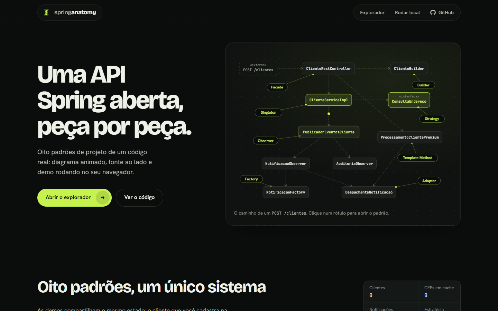
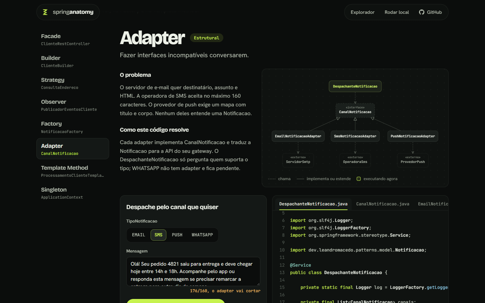
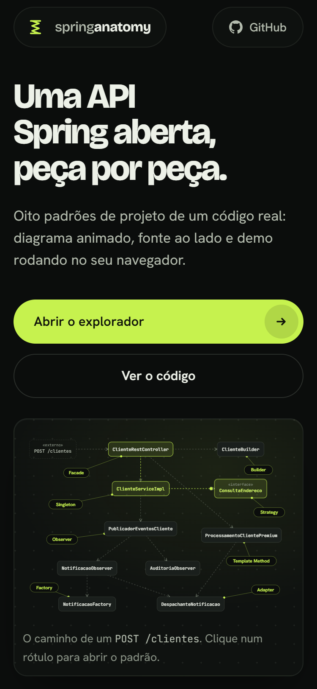

# Spring Anatomy

**Oito padrões de projeto dissecados dentro de uma API Spring Boot real: diagrama animado, o código-fonte ao lado e uma demo que roda no seu navegador.**

[**Ver ao vivo**](https://leandromlmoreira.github.io/spring-anatomy/) · [Rodar localmente](#como-rodar) · [Arquitetura](#arquitetura)



## O que é

A maioria dos exemplos de padrões de projeto vive em classes de brinquedo: `Pato`, `Pizza`, `Carro`. Aqui eles estão dentro de uma API de clientes que funciona de verdade, com banco H2, consulta de CEP no ViaCEP, notificações por e-mail, SMS e push, e 41 testes JUnit.

O explorador abre cada peça do sistema e mostra, lado a lado:

- **o problema** que o padrão resolve neste código, em duas frases;
- **o diagrama de classes** desenhado em SVG, que acende e dispara pacotes pelas setas enquanto o código roda;
- **o código real do repositório**, com a linha em execução destacada a cada passo;
- **uma demo executável**, portada fielmente do Java para TypeScript, que funciona sem backend.

| Padrão | Peça no código | O que dá para fazer na demo |
|---|---|---|
| Facade | `ClienteRestController` | Cadastrar um cliente e ver o CEP resolvido ao vivo pelo ViaCEP |
| Builder | `ClienteBuilder` | Montar um cliente campo a campo e ver o `build()` recusar cliente sem nome |
| Strategy | `ConsultaEndereco` | Trocar entre ViaCEP e offline em tempo real |
| Observer | `PublicadorEventosCliente` | Cadastrar, atualizar e remover e ver dois observers reagindo |
| Factory | `NotificacaoFactory` | Pedir notificações por tipo em texto livre, inclusive tipos inválidos |
| Adapter | `CanalNotificacao` | Despachar por e-mail, SMS, push ou WhatsApp e ver a tradução para cada gateway |
| Template Method | `ProcessamentoClienteTemplate` | Rodar o mesmo esqueleto com o plano padrão ou premium |
| Singleton | `ApplicationContext` | Chamar `getBean` várias vezes e comparar os escopos singleton e prototype |

As demos compartilham o mesmo estado: o cliente cadastrado na Facade aparece no Observer, na Factory e no Template Method.



<p align="center"></p>

## Arquitetura

```
POST /clientes
  └─ ClienteRestController ............ Facade
       ├─ ClienteRequest → ClienteBuilder ... Builder
       └─ ClienteServiceImpl .......... bean Singleton
            ├─ ConsultaEndereco ....... Strategy (ViaCEP ou offline)
            ├─ Endereco/Cliente repositories (H2)
            └─ PublicadorEventosCliente ... Observer
                 ├─ NotificacaoObserver
                 │    ├─ NotificacaoFactory ...... Factory
                 │    └─ DespachanteNotificacao
                 │         └─ CanalNotificacao ... Adapter (SMTP, SMS, push)
                 └─ AuditoriaObserver

POST /clientes/{id}/processamento
  └─ CatalogoProcessamentos → ProcessamentoClienteTemplate ... Template Method
```

```
src/main/java/dev/leandromacedo/patterns
├── controller   REST, validação e ProblemDetail
├── service      ClienteService e a implementação
├── strategy     ConsultaEndereco, ViaCEP (HTTP interface) e offline
├── observer     publicador, eventos e observers
├── factory      NotificacaoFactory
├── adapter      canais e gateways simulados
├── template     processamento padrão e premium
├── builder      ClienteBuilder
├── model        entidades JPA, CEP e TipoNotificacao
└── repository   Spring Data JPA

web/
├── src/engine   porte em TypeScript do domínio Java, com rastro de execução
├── src/ui       explorador, diagramas SVG, painel de código e realce de sintaxe
├── src/demos    uma demo por padrão
└── e2e          testes Playwright
```

A interface importa os arquivos `.java` do repositório no build (`import.meta.glob` com `?raw`), então o código exibido é sempre o código da branch publicada. Cada classe do porte em TypeScript registra as chamadas num rastro, e o explorador usa esse rastro para animar o diagrama e destacar o método Java correspondente.

## Stack

- **API:** Java 21, Spring Boot 3.3, Spring Data JPA, H2, Bean Validation, cliente HTTP declarativo (`@GetExchange`) para o ViaCEP, springdoc OpenAPI.
- **Interface:** Vite, TypeScript sem framework, SVG e CSS próprios, fontes Bricolage Grotesque, Hanken Grotesk e JetBrains Mono.
- **Qualidade:** JUnit 5, Mockito e MockMvc na API; Vitest e Playwright na interface; ESLint; GitHub Actions para CI e deploy no GitHub Pages.

## Como rodar

### API Spring

Requer JDK 21. O wrapper baixa o Maven sozinho.

```bash
./mvnw spring-boot:run
```

- Swagger: http://localhost:8080/swagger-ui.html
- Console H2: http://localhost:8080/h2-console (JDBC `jdbc:h2:mem:anatomy`, usuário `sa`)
- Sem internet? Use a estratégia offline: `./mvnw spring-boot:run -Dspring-boot.run.arguments=--anatomy.endereco.estrategia=offline`

| Método | Rota | O que faz |
|---|---|---|
| `GET` | `/clientes` | Lista clientes |
| `POST` | `/clientes` | Cadastra (`{"nome": "...", "cep": "01001-000"}`) |
| `PUT` | `/clientes/{id}` | Atualiza e dispara aviso por SMS |
| `DELETE` | `/clientes/{id}` | Remove e dispara aviso por push |
| `POST` | `/clientes/{id}/processamento?plano=premium` | Roda o Template Method |
| `GET` | `/notificacoes?clienteId=` | Lista notificações |
| `POST` | `/notificacoes` | Cria pela factory (`{"tipo": "sms", "mensagem": "...", "clienteId": 1}`) |
| `POST` | `/notificacoes/{id}/envio` | Envia pelo adapter; `422` se não houver canal |
| `GET` | `/auditoria` | Trilha do `AuditoriaObserver` |

### Interface

Requer Node 22.

```bash
cd web
npm install
npm run dev
```

## Testes

```bash
./mvnw test              # 41 testes JUnit: unidade por padrão e API de ponta a ponta com MockMvc

cd web
npm run lint             # ESLint
npm test                 # Vitest: porte do domínio, realce de sintaxe e localização de métodos
npm run test:e2e         # Playwright em desktop e mobile, com o ViaCEP simulado
```

---

<sub>Nasceu do lab "Explorando Padrões de Projeto na Prática com Java" da DIO e foi reescrito como projeto próprio.</sub>
